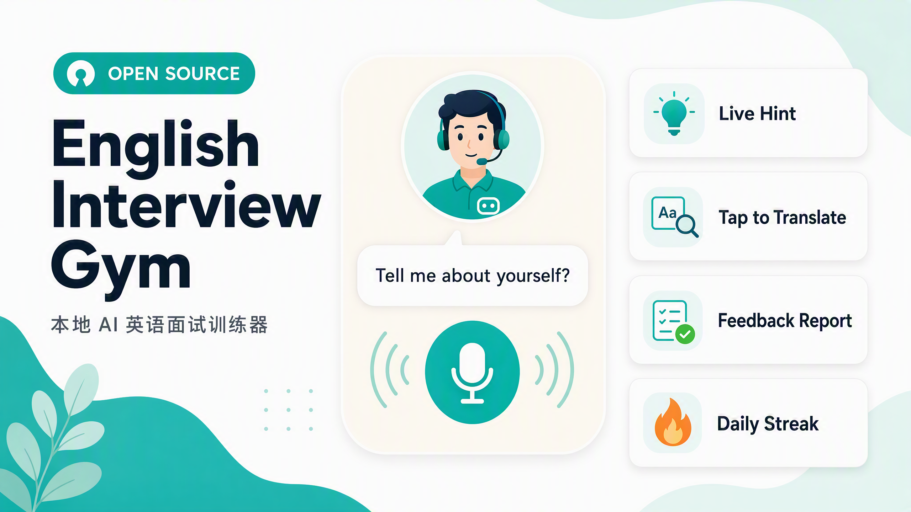

<p align="center">
  
</p>

<h1 align="center">English Interview Gym<br>英语面试健身房</h1>

<p align="center">
  <b>每天 20 分钟，和 AI 面试官开口对练，把"日常英语"练成"面试流利"。</b><br>
  <b>语音模拟面试 · 实时提示 · 点词速查 · 即时纠错 · 复盘打卡 —— 本地运行，数据不出你的电脑。</b>
</p>

<p align="left">
  <a href="README_en.md"><b>English</b></a> | <a href="README.md"><b>中文</b></a>
</p>

<p align="center">
  
  
  
  
</p>

<p align="center">
  
</p>

## 目录

- [这是什么](#这是什么)
- [快速开始](#快速开始)
- [模型需求与推荐](#模型需求与推荐)
- [功能详解](#功能详解)
  - [模拟面试](#模拟面试)
  - [示范答案与实时提示](#示范答案与实时提示)
  - [点词速查](#点词速查)
  - [即时反馈与评分](#即时反馈与评分)
  - [复盘报告与错题本](#复盘报告与错题本)
  - [打卡与进度](#打卡与进度)
  - [题目卡片墙](#题目卡片墙)
  - [简历导入](#简历导入)
- [配置手册](#配置手册)
- [自定义与扩展](#自定义与扩展)
- [目录结构](#目录结构)
- [隐私说明](#隐私说明)
- [内容来源与免责声明](#内容来源与免责声明)
- [常见问题](#常见问题)
- [开源协议](#开源协议)

## 这是什么

一个跑在你电脑上的英语面试训练器。核心循环只有一件事——**开口说**：

> AI 面试官语音提问 → 你开口回答（自动转写）→ 即时纠错、评分、教你更好的说法 → 追问或下一题

每次练习自动计入打卡与趋势统计；每道题都能回看历史、重练、看到进步曲线。它针对三类常见困境：

- **没人陪练**——3 种 AI 面试官人格 × 82 道高频题（HR 初面 / 技术面 / 压力面），随时开始，永不嫌你烦；
- **不知道怎么说**——每题附带 30–45 秒示范答案（「🧩 通用版」开箱即用；导入简历解锁「🎯 定制版」），全站单词点击即查，卡壳时还有「照读示范」模式兜底；
- **练完没反馈**——每轮纠错 / 升级 / 改写三张卡片 + 1–10 分；整场结束生成五维复盘报告与错题本。

| 功能 | 能干嘛 | 入口 |
|---|---|---|
| 🎙️ 模拟面试 | 3 种人格 × 3 套题库，语音问答、自然追问 | 首页「选择你的 AI 导师」 |
| 💡 示范答案 | 每题 30–45 秒示范：通用版 / 定制版 | 对话页「📖 示范答案」 |
| 🔍 点词速查 | 音标 · 语境释义 · 例句 · 发音 · 收藏 | 全站任意单词 |
| ✍️ 即时反馈 | Correction / Upgrade / Revision + 1–10 分 | 每轮回答后自动出现 |
| 📋 复盘报告 | 五维评分 + 下次重点 + 错题本 | 右上角「复盘」 |
| 🔥 打卡与进度 | 连续天数 · 每日目标圆环 · 14 天日历 | 首页打卡面板 |
| 🗂 题目卡片墙 | 82 题卡片：状态 / 最高分 / 趋势 / 单题历史 | 首页「选择题集」 |
| 📄 简历导入 | 解锁基于你真实经历的定制版答案 | 「📄 我的简历」 |

## 快速开始

**环境要求**：macOS（Apple Silicon 体验最佳）+ Python 3.12 + `ffmpeg`（`brew install ffmpeg`）+ 一个 API Key（自备：任何 OpenAI 兼容服务均可，官方 API 或聚合网关）。

### 1. 克隆并安装

```bash
git clone https://github.com/Chemwzd/english-interview-gym.git
cd english-interview-gym
python3 -m venv .venv            # 装了 uv 也可以：uv venv .venv --python 3.12
.venv/bin/pip install -r app/requirements.txt
```

### 2. 填入 API Key

```bash
cp app/.env.example app/.env     # 填入 API_KEY=你的key、API_BASE_URL=你的服务地址
                                 # （服务地址也可写在 app/config.yaml 的 llm.base_url）
                                 # 对话模型 / 语音识别 / 语音合一共用一个 Key
```

或者运行交互式配置助手（会在线验证 Key 再写入）：

```bash
python3 scripts/setup_env.py
```

> 需要哪些模型（对话 / 语音识别 / 语音合成）、推荐用哪个、大概花多少钱？→ [模型需求与推荐](#模型需求与推荐)

### 3. 启动

```bash
bash scripts/run_server.sh       # 或直接双击「打开训练系统.command」
```

打开 http://127.0.0.1:8765（首次使用请允许浏览器访问麦克风）。

### 4. 第一次练习（约 10 分钟）

1. 首页「选择你的 AI 导师」→ 点导师**试听音色**，选定人格；
2. 「选择题集」→ 先进 `baseline-8`（8 题热身）；
3. 点任意题卡 → 「🎙 从这题开练」→ 点麦克风（或按空格）开口；
4. 说完再点一次麦克风 → 看转写、反馈卡与评分 → 继续下一题；
5. 练完点右上角「复盘」生成整场报告。

### 5. 体检与周报（可选）

```bash
.venv/bin/python scripts/check_stack.py       # 逐链路体检：对话 / 语音识别 / 语音合成
.venv/bin/python scripts/baseline_report.py   # 练习周报
```

## 模型需求与推荐

本应用**一次完整练习会用到三类模型**——不只是聊天模型。三者通过你在 `app/.env` 里配置的**同一个 API Key** 调用（自备：任何 OpenAI 兼容服务均可，官方 API 或聚合网关）：

| 用途 | 用在哪里 | 推荐模型（示例） | 参考价（人民币，按量后付费） |
|---|---|---|---|
| 💬 对话模型 | 提问追问、示范答案、纠错评分、复盘报告、点词释义 | **DeepSeek-V4.1-Flash**（`deepseek/deepseek-flash`，默认）；备选 **GLM-5.3-Flash**（`glm-5.3-flash`） | DeepSeek：¥1–2 输入 / ¥4–8 输出；GLM：¥0.8 / ¥2.8（每百万 tokens，闲时/高峰） |
| 🎙️ 语音识别 ASR | 把你的口述回答转成文字 | **Hy-ASR-3.0-Preview**（`hy-asr-3.0-preview`，默认）；备选 `wand-asr-v1` | Hy-ASR：¥0.00022/秒（约 ¥0.79/小时）；WAND：¥0.0005/秒 |
| 🔊 语音合成 TTS | 面试官提问的语音 | **MiniMax-Speech-2.8-Turbo**（`minimax-speech-2.8-turbo`，默认，内置 4 种英文音色）；`-hd` 音质更好 | Turbo：¥2/万字符；HD：¥3.5/万字符 |

**成本估算（20 分钟/天，全部走云端）**：对话 ≈ ¥0.1/天 + 识别 ≈ ¥0.26/天 + 合成 ≈ ¥0.2–0.4/天 ≈ **合计 ¥0.6–0.8/天，约 ¥20/月**（按量后付费；实际以服务商账单为准；晚间练习多落在闲时计费时段，单价更低）。

**两条语音链路可以零成本本地化（macOS）**：

- `asr.driver: local` —— mlx-whisper 本机识别（Apple Silicon，免费）；
- `tts.driver: macos_say` —— macOS 内置 `say` 朗读（免费，音色偏机械）。

两者同时启用后，训练成本只剩对话模型 **≈ ¥0.1/天**。

**注意事项**：

- 语音调用若报 `402 / 401007`：多为服务商侧未开通相关能力（常见为需开启"后付费"），按其控制台提示处理一次即可；
- 计价规则以服务商为准（DeepSeek 系列常见为工作日 9:00–12:00、14:00–18:00 高峰时段 ×2 价，其余时段及周末闲时）；
- 默认 fallback 链含 `kimi-k3`（单价较高，仅主模型失败时触发），在意成本可自行调整 `llm.fallback_models`。

换模型：改 `app/config.yaml` 的 `llm.model` / `asr.model` / `tts.cloud_model` 即可（均支持 fallback 链）。

## 功能详解

### 模拟面试

**能干嘛**：和面试官"你一句我一句"地真实对话——面试官语音提问，你开口回答，自动转写成文字，然后是追问或下一题。

- 3 种人格（`materials/personas/`）：`hr-friendly` 友善 HR、`tech-lead` 技术面试官、`stress` 压力面；
- 3 套题库：`baseline-8`（8 题热身）、`interview-core`（14 题核心）、`mnc-60`（60 题大厂高频）。

**怎么用**：首页选人格 → 选题集 → 点题卡「🎙 从这题开练」→ 点麦克风（或按空格）→ 答完再点一次 → 看反馈 → 下一题。对话页顶部可选「自己说 / 照读示范」两种模式；中途「跳过这题」；随时「复盘」结束整场。

**怎么配置**：
- 单题回答时长上限：`app/config.yaml` → `session.max_answer_seconds`（默认 120 秒）；
- 换音色：`app/config.yaml` → `tts.voices`（每个人格一个音色）；
- 加自己的题 / 题库：见[自定义与扩展](#自定义与扩展)。

### 示范答案与实时提示

**能干嘛**：任何一题都可以先看"这题可以怎么说"——一份 30–45 秒（约 60–100 词）的商务范例答案：

- 「🧩 通用版」：开箱即用，含 `[方括号]` 占位符，替换成自己的信息即可；
- 「🎯 定制版」：导入简历后解锁，用你真实经历和数字组织答案（见[简历导入](#简历导入)）。

**怎么用**：对话页点「📖 示范答案」→ 在「🧩 通用版 / 🎯 定制版」标签间切换 → 想跟读时点「🎧 照读这段」进入照读模式。

**怎么配置**：无需配置；定制版取决于是否导入简历。

### 点词速查

**能干嘛**：对话、示范答案、反馈卡片、复盘报告里的**任意英文单词**点一下，弹出音标、词性、**结合当前语境**的释义、例句与发音；一键「⭐ 收藏生词」。同一个词在不同语境会给出不同解释。

**怎么用**：单击单词 → 看释义卡 → 🔊 听发音 → ⭐ 收藏。收藏列表在「⭐ 收藏夹」中回顾。

**怎么配置**：无需配置；查询结果缓存在 `data/gloss_cache.json`，重复查询秒回。

### 即时反馈与评分

**能干嘛**：每次回答后自动给出三张卡片——

- **Correction** 纠错：语法 / 用词 / 时态；
- **Upgrade** 升级：口语表达 → 面试官期待的地道表达；
- **Revision** 改写：润色后的完整回答，可直接跟读。

外加 1–10 综合分。用「照读示范」模式回答时，还会给出**照读准确率**（漏读 / 添词逐词对照）。

**怎么用**：答完自动出现，不必操作；卡片里的单词同样可以点词速查、⭐ 收藏。

**怎么配置**：无需配置。

### 复盘报告与错题本

**能干嘛**：结束一场后生成「本场复盘」：内容 / 结构 / 语法 / 词汇 / 流利度五个维度评分 + 下次重点建议 + 练习清单；反复出现的错误自动汇入错题本，方便专项复练。

**怎么用**：右上角「复盘」→ 10–20 秒生成报告（同时存入 `data/reports/`）。

**怎么配置**：无需配置。

### 打卡与进度

**能干嘛**：把"开口量"像健身一样记录：连续打卡天数、每日目标圆环（默认 20 分钟）、最近 14 天分钟数日历、统计卡片；连续 3 / 7 / 14 / 30 / 50 / 100 天有庆祝动画。

**怎么用**：首页打卡面板自动更新；练完即计入今天。

**怎么配置**：每日目标改 `app/config.yaml` → `session.daily_goal_minutes`（默认 20）。

### 题目卡片墙

**能干嘛**：每个题集以卡片墙展开：配图 + 中文短标题 + 练习状态 + 最高分。点开卡片看**单题历史**——每次作答的日期、模式（自由说 / 照读）、时长、语速（WPM）、得分，以及一条分数趋势线；也可以直接从这题重练。

**怎么用**：首页「选择题集」→ 卡片墙；底部「▶ 继续练习」自动跳到第一道未练的题（练完一轮变为「▶ 再练一遍」）。

**怎么配置**：题目配图放在 `materials/question-bank/images/<题集>/<题号>.png`，题卡墙自动显示（内置题集已附带配图）。

### 简历导入

**能干嘛**：上传简历（`.docx` / `.pdf` / 直接粘贴文本），示范答案解锁「🎯 定制版」——用你的真实经历、项目与数字组织答案。简历只保存在本机。

**怎么用**：右上角「📄 我的简历」→ 选择文件或粘贴文字 → 保存；随时可删除（删除后退回仅有通用版）。

**怎么配置**：也可以手动编辑 `materials/profile.md`（格式参考 `materials/profile.example.md`）。

## 配置手册

### 环境变量（`app/.env`）

| 变量 | 必填 | 用途 |
|---|---|---|
| `API_KEY` | ✅ | 对话模型 + 语音识别 + 语音合成共用一个 Key（自备） |
| `API_BASE_URL` | – | 覆盖接口地址（指向你的 OpenAI 兼容服务） |

### 应用配置（`app/config.yaml`）

| 配置项 | 默认值 | 说明 |
|---|---|---|
| `llm.base_url` | 留空 | 你的 OpenAI 兼容接口地址（也可用 `API_BASE_URL`） |
| `llm.model` | `deepseek/deepseek-flash` | 主对话模型 |
| `llm.fallback_models` | 见文件 | 主模型失败时的备选链 |
| `asr.driver` | `auto` | `auto` / `cloud`（云端识别）/ `local`（mlx-whisper，仅 macOS） |
| `asr.endpoint` / `tts.endpoint` | 留空 | 云端语音接口地址；留空自动使用本地模式 |
| `tts.driver` | `cloud` | `cloud` / `macos_say`（离线兜底） |
| `tts.voices` | 见文件 | 每个人格一个音色 |
| `session.daily_goal_minutes` | `20` | 每日目标（分钟），影响打卡圆环 |
| `session.max_answer_seconds` | `120` | 单题回答时长上限 |
| `server.port` | `8765` | 服务端口 |
| `tools.ffmpeg` | `ffmpeg` | ffmpeg 可执行文件路径 |

### 运行数据（`data/`，全部仅本地）

| 路径 | 内容 |
|---|---|
| `data/sessions/*.jsonl` | 每场训练的逐轮记录（含评分） |
| `data/reports/` | 复盘报告 |
| `data/errorbook.jsonl` | 错题本 |
| `data/favorites.jsonl` | 收藏的生词与句子 |
| `data/gloss_cache.json` | 点词速查缓存 |
| `data/audio/` | 录音文件 |

## 自定义与扩展

- **题目 / 题库**——普通 YAML，直接改或新增 `materials/question-bank/` 下的文件：

  ```yaml
  key: my-bank
  title: 我的题库
  questions:
    - id: q1
      round: HR 初面
      category: 开场
      text: "Tell me about yourself."
      intent: 考察意图
      hint: 答题思路
      followups:
        - "What's the one thing you want me to remember?"
  ```

- **题目配图**——PNG 放进 `materials/question-bank/images/<题库key>/<题号>.png`，题卡墙自动显示；
- **面试官人格**——`materials/personas/*.md`，在 `### system` 块里定义角色与提问风格；
- **故事库**——复制 `materials/stories/template.md`，攒 5–8 个打磨过的个人故事，面试答案更扎实。

## 目录结构

```text
english-interview-gym/
├── 打开训练系统.command          # macOS 双击一键启动
├── app/
│   ├── config.yaml              # 应用配置（模型 / 语音 / 打卡目标）
│   ├── .env.example             # 环境变量模板（复制为 .env 后填 Key）
│   ├── requirements.txt
│   ├── server/                  # FastAPI 后端：会话 · 模型调用 · 语音识别 · 语音合成 · 报告
│   └── web/                     # 单页前端（无框架构建，开箱即用）
├── materials/
│   ├── personas/                # 3 种面试官人格
│   ├── question-bank/           # 3 套题库（YAML）+ 配图 + 元信息
│   ├── stories/                 # 个人故事库（模板 + 说明）
│   ├── wordlist/                # 生词表
│   └── profile.example.md       # 简历模板（复制为 profile.md 手写）
├── scripts/                     # setup_env · run_server · check_stack · baseline_report
├── data/                        # 运行数据（仅本地，gitignore）
└── docs/                        # RUNBOOK 运行手册 · PRACTICE-PLAN 练习计划 · 图片资源
```

## 隐私说明

- **100% 本地运行**：服务只监听 `127.0.0.1`，训练数据（录音 / 转写 / 报告 / 生词）全部保存在本机 `data/`，不会上传到任何第三方；
- **最小化外发**：回答的音频与文本只发送到**你自己配置的** API 接口（用于转写与反馈），密钥只存在本机 `app/.env`；
- **无遥测**：没有统计上报、没有账号体系；
- **公开仓库零个人信息**：`app/.env`、`materials/profile.md`、`data/` 均被 .gitignore 忽略，不随仓库分发。

## 内容来源与免责声明

- **来源**：题库题目（`materials/question-bank/`）整理自**互联网公开渠道**（社区面经、公开面试题汇总、公开招聘信息与岗位要求等），收录时已做通用化改写；每题的考察意图与答题提示为本项目自行撰写；
- **不主张权利**：本项目不对题目原始出处主张任何权利，也不保证与任何具体公司、机构的实际面试题库对应；
- **使用范围**：题库等文字内容仅供**个人学习交流**，请勿用于商业用途；代码部分以 MIT 协议开源；
- **侵权处理**：如任何权利人认为仓库内容（题目、配图等）侵犯了您的权益，请通过 [Issues](../../issues) 联系，我们将在核实后**立即下架相关内容**。

## 常见问题

| 症状 | 处理 |
|---|---|
| 提交后报 `402 / 401007` | 服务商侧语音模型未开通（常见为需开"后付费"）；或把 `asr.driver` 设为 `local` |
| 麦克风不可用 | 必须用 `http://127.0.0.1` 打开（不要用局域网 IP）；浏览器允许麦克风权限 |
| 端口被占用 | 改 `app/config.yaml` 的 `server.port`，同步改 `scripts/run_server.sh` 里的 `--port` |
| 想换音色 / 换大模型 | 音色改 `tts.voices`；模型：`API_BASE_URL` + `llm.model` 指向任意 OpenAI 兼容服务 |
| 想尽量免费 / 全本地跑 | 语音本地化：`asr.driver: local` + `tts.driver: macos_say`（仅 macOS，免费）；对话模型需一个 OpenAI 兼容服务（云端或本地推理服务均可） |

## 开源协议

本项目基于 [MIT License](LICENSE) 发布，欢迎 Issue 与 PR。题库等内容的来源与使用要求见[内容来源与免责声明](#内容来源与免责声明)。
