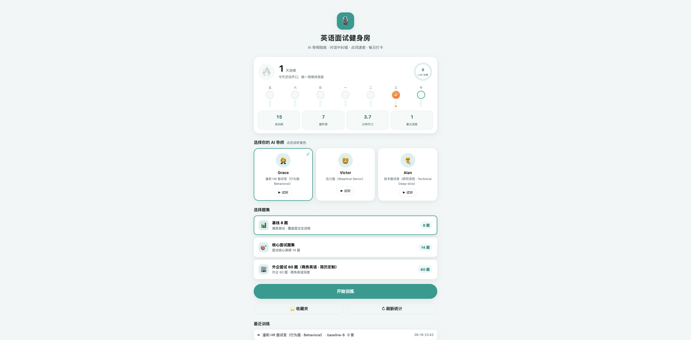
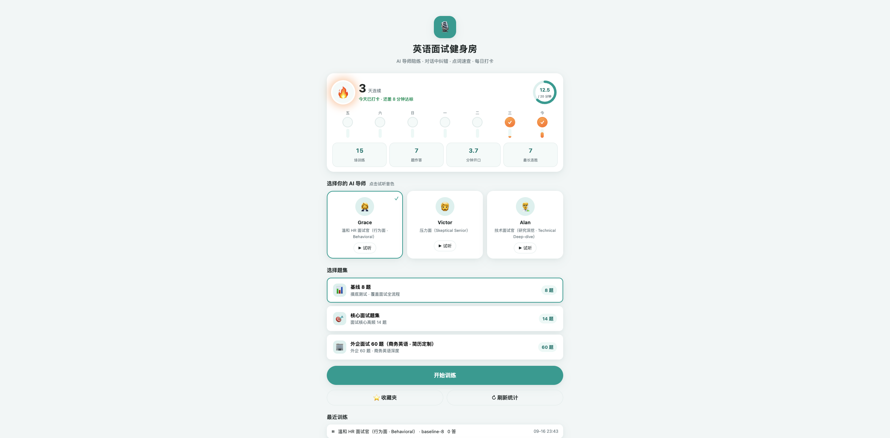
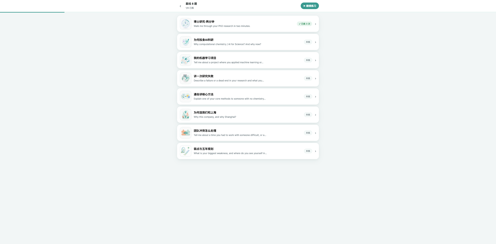
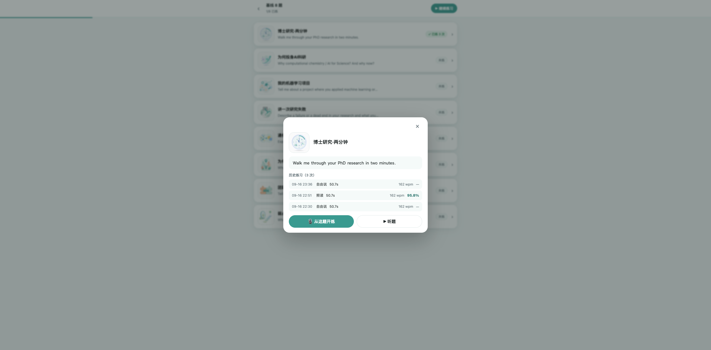
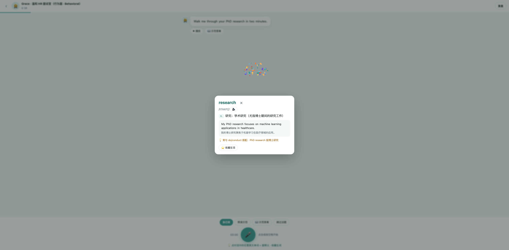
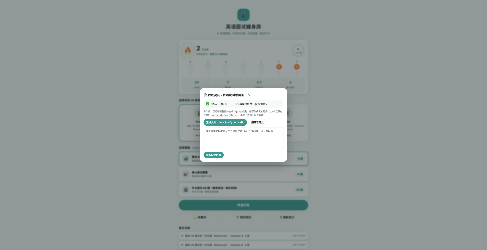
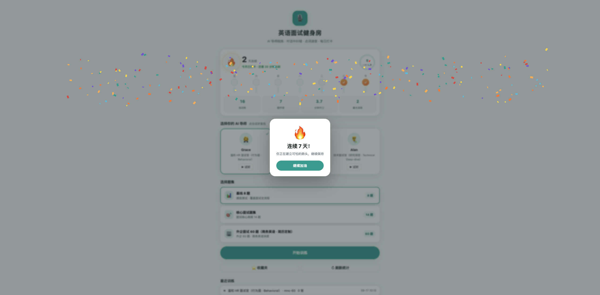

# EngTraining · 英语面试健身房

一个跑在**自己电脑上**的 AI 英语面试训练系统：**回合制语音面试模拟 + 每题即时反馈 + 点词速查 + 单题练习历史 + 每日打卡**。

从"日常英语"练到"商务/英文面试流利"——所有数据（录音、转写、报告、简历）只保存在本机，**自带 API Key 即可使用**。

> 定位说明：默认题库与词表示例面向 **STEM / 科研岗**，可替换为任意领域的面试题——题库就是普通 YAML，改文本即可。

## ✨ 功能

| 模块 | 说明 |
|---|---|
| 🎙️ 面试模拟 | 3 种 AI 面试官人格（友善 HR / 技术官 / 压力面），TTS 发问，你开口作答（语音识别转写），回合制含追问 |
| 📖 示范答案 | 每题一键生成 **🧩 通用框架版**；在首页导入自己的简历后，额外解锁 **🎯 个人定制版**（基于你的真实经历，30–45 秒商务短答） |
| 🔍 点词速查 | 对话中任意英文单词可点击：音标 + 语境释义 + 例句 + 发音，一键收藏生词 |
| ✍️ 即时反馈 | Correction / Upgrade / Revision 三段式 + 1–10 综合分；照读模式有逐词比对准确率 |
| 🗂 题集卡片墙 | 每个题集是一面题目卡片（配图 + 中文短标题 + 练习状态）；点开看**每次练习历史**（用时/语速/分数 + 趋势曲线），可从任意一题开练 |
| 📅 打卡面板 | 连续天数、每日目标环、7 天日历、连胜里程碑庆祝 |
| 📚 复盘 | 每场训练生成评分报告 + 错题本（language point / upgrade 自动入库） |

## 📸 界面预览









## 🚀 快速开始

先决条件：macOS（推荐；另有本地 ASR 兜底仅限 Apple Silicon）或任意可跑 Python 3.12 的系统；[uv](https://docs.astral.sh/uv/)（或 pip）；`ffmpeg` 在 PATH。

```bash
# 1) 克隆并安装依赖
git clone https://github.com/Chemwzd/english-interview-gym.git && cd english-interview-gym
uv venv .venv --python 3.12
uv pip install --python .venv/bin/python -r app/requirements.txt

# 2) 配置你自己的 API Key（不会提交到 git）
cp app/.env.example app/.env
#    编辑 app/.env，填入你的腾讯云 TokenHub API Key
#    申请入口: https://console.cloud.tencent.com/tokenhub  （LLM/语音共用一个 Key；语音模型需开通"后付费"）

# 3) 启动
bash scripts/run_server.sh        # 然后打开 http://127.0.0.1:8765
# macOS 也可以双击项目根目录的 `打开训练系统.command`
```

体检三条链路（LLM / 语音识别 / 语音合成）：

```bash
.venv/bin/python scripts/check_stack.py
```

> 💡 体检脚本与本地方案（macOS `say` / `mlx-whisper`）仅在 macOS 上可用；其他系统使用云端链路即可，不影响主流程。
> 💡 想用别的模型/网关？任何 **OpenAI 兼容**接口都可以：在 `app/.env` 里设置 `TOKENHUB_BASE_URL` 指向你的网关，并在 `app/config.yaml` 里改 `llm.model` / `llm.fallback_models`。
> 💡 不想用云端语音？`app/config.yaml` 里把 `asr.driver` 设为 `local`（需 `mlx-whisper`）、`tts.driver` 设为 `macos_say`。

## 🔒 隐私说明

- `app/.env`（你的密钥）、`materials/profile.md`（你导入的简历）、`data/`（录音/转写/报告）**全部被 `.gitignore` 忽略**，永不入库；
- 简历只保存在本机文件，除了调用你配置的 AI 接口外不经过任何第三方；
- 公开仓库中不包含任何个人经历与个人信息——个人定制能力来自你自行导入的简历。

## 🗂 目录结构

```
app/        # FastAPI 服务（server 后端 / web 单页前端）
materials/  # 内容层：personas 面试官人格 / question-bank 题库(含配图) / stories 故事库模板 / wordlist 词表
scripts/    # 一键启动 / 环境体检 / 训练周报 / 题目元信息与配图生成
data/       # 运行数据（本地）：sessions / reports / audio / errorbook（已忽略）
docs/       # RUNBOOK 运行手册 / PRACTICE-PLAN 练习计划 / 界面截图
```

想给题目卡片配上形象插画？先运行 `scripts/gen_question_meta.py` 生成标题与生图提示词，再用 `scripts/gen_question_images.py` 调腾讯云 VOD AIGC 生图（完全可选；需腾讯云 VOD 凭证，且本机具备对应生图脚本、可用环境变量 `VOD_IMAGE_SCRIPT` 指定路径；不使用该功能时卡片显示首字占位，其余能力不受影响）。

## 📄 License

MIT
