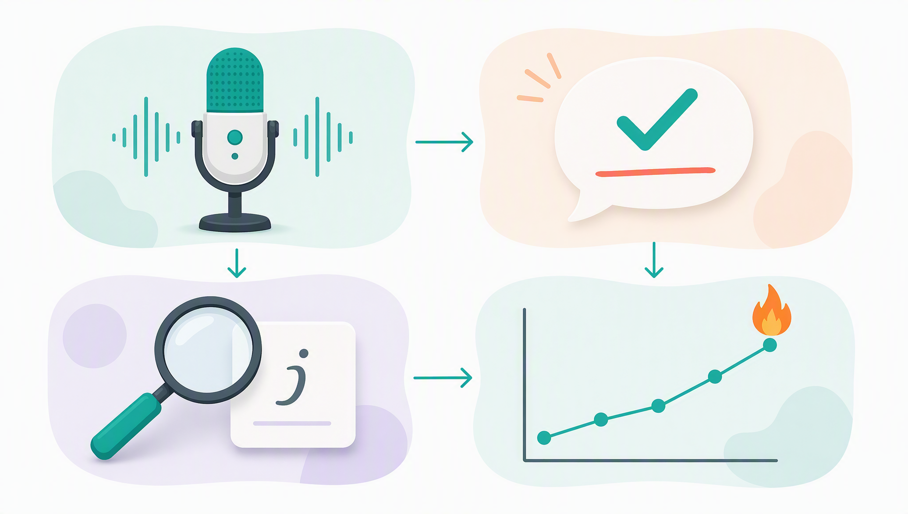

<p align="center">
  
</p>

<h1 align="center">English Interview Gym<br>英语面试健身房</h1>

<p align="center">
  <b>A self-hosted AI English interview trainer. Turn-based voice mock interviews, instant corrections, click-to-lookup vocabulary, and progress you can actually see.</b><br>
  <b>本地部署的 AI 英语面试训练系统：语音模拟面试 · 即时纠错 · 点词速查 · 看得见的进步。</b>
</p>

<p align="center">
  <a href="#english"><b>🇬🇧 English</b></a> · <a href="#chinese"><b>🇨🇳 简体中文</b></a><br><br>
  
  
  
  
</p>

<p align="center">
  
</p>

---

<a id="english"></a>

# 🇬🇧 English

> **Jump to:** [How it works](#en-how) · [Features](#en-features) · [Quick start](#en-quickstart) · [Daily use](#en-daily) · [Configuration](#en-config) · [Customize](#en-customize) · [FAQ](#en-faq)

## <a id="en-how"></a>How it works

One 20-minute session = **one question at a time**, spoken out loud:

```
AI interviewer asks (voice)  →  you answer (voice, transcribed)
      ↑                                      ↓
next question / follow-up  ←  instant feedback + polished revision  →  scored & logged
```

Every answer gets corrections and a 1–10 score; every question keeps a practice history, so your improvement becomes a visible trend line instead of a feeling.

## <a id="en-features"></a>✨ Features

<p align="center"></p>

| | Feature | What it does |
|---|---|---|
| 🎙️ | **Voice mock interviews** | 3 AI interviewer personas (friendly HR / technical lead / stress interviewer). The interviewer speaks, you answer out loud, with natural follow-up questions. |
| 📖 | **Sample answers, two versions** | Every question generates a lean 30–45 s business answer: a **generic framework version** out of the box; import your resume to unlock a **personalized version** grounded in your real experience. |
| 🔍 | **Click-word lookup** | Tap any English word in the conversation — IPA, context-aware meaning, example sentence, pronunciation; one click to save it to your vocabulary collection. |
| ✍️ | **Instant feedback** | **Correction / Upgrade / Revision** cards plus a 1–10 score for every answer; reading mode adds word-level accuracy against the script. |
| 🗂 | **Question card wall** | Each question set opens as a wall of illustrated cards (title, status, best score). Open a card for **per-question history** — date, mode, duration, WPM, score — with a score **trend line**. Start from any question. |
| 📅 | **Streaks & stats** | Consecutive days, daily goal ring (minutes spoken), 7-day calendar, milestone celebrations. |
| 📚 | **Review & errorbook** | End a session for a scored review (content / structure / grammar / vocabulary / fluency) + drills; recurring mistakes auto-collect into an errorbook. |

## <a id="en-quickstart"></a>🚀 Quick start

**Prerequisites**: Python 3.12, [`uv`](https://docs.astral.sh/uv/) (or pip), `ffmpeg` on PATH. macOS is first-class (optional local fallbacks use macOS `say` / `mlx-whisper`); other systems work via the cloud pipeline.

```bash
git clone https://github.com/Chemwzd/english-interview-gym.git
cd english-interview-gym
uv venv .venv --python 3.12
uv pip install --python .venv/bin/python -r app/requirements.txt

cp app/.env.example app/.env     # then set TOKENHUB_API_KEY=your-key in app/.env
                                 # get one at https://console.cloud.tencent.com/tokenhub
                                 # (LLM + ASR + TTS share one key; enable "postpaid" for voice models)

bash scripts/run_server.sh       # open http://127.0.0.1:8765
```

Health check for all pipelines: `.venv/bin/python scripts/check_stack.py`

> 💡 Use any OpenAI-compatible gateway: set `TOKENHUB_BASE_URL` in `app/.env` and change `llm.model` in `app/config.yaml`. Fully offline speech: `asr.driver: local` (needs `mlx-whisper`, macOS) + `tts.driver: macos_say`.

## <a id="en-daily"></a>🎧 Daily use in 30 seconds

| You want to… | Do this |
|---|---|
| Practice one question | Question set → tap a card → **「🎙 Start from this question」** → speak → review feedback |
| Keep the recommended path | Question set → **「Continue」** (auto-jumps to your first unpracticed question) |
| Hear a model answer | Any question → **📖 Sample answer** (🎯 personalized tab appears after you import your resume) |
| Look up a word | Tap any word anywhere → card with meaning + pronunciation → **⭐ Save** |
| Check your improvement | Question card → per-question history & trend · Home → streak panel & stats |
| Review a session | **「Review」** top-right → scored report + drills |

Recording: click the mic or **press Space**.

## <a id="en-config"></a>⚙️ Configuration

**Environment variables (`app/.env`)** — only one key is required:

| Variable | Required | Purpose |
|---|---|---|
| `TOKENHUB_API_KEY` | ✅ | One key for LLM + ASR + TTS (Tencent Cloud TokenHub or any compatible gateway) |
| `TOKENHUB_BASE_URL` | – | Override API base URL (point at any OpenAI-compatible gateway) |
| `TENCENTCLOUD_SECRET_ID` / `SECRET_KEY` / `REGION` / `VOD_SUB_APP_ID` | – | Only for the optional VOD image-generation scripts |

**`app/config.yaml`**: `llm.model` & `llm.fallback_models` (default `deepseek/deepseek-flash`) · `asr.driver` (`auto`/`tokenhub`/`local`) · `tts.driver` & per-persona `tts.voices` · `session.daily_goal_minutes` · `tools.ffmpeg`.

## <a id="en-customize"></a>🎯 Make it yours

- **Question banks** — plain YAML under `materials/question-bank/`:

  ```yaml
  key: my-bank
  title: My question set
  questions:
    - id: q1
      round: HR screen
      category: Intro
      text: "Tell me about yourself."
      intent: Why they ask this.
      hint: How to structure your answer.
      followups:
        - "What's the one thing you want me to remember?"
  ```

- **Interviewer personas** — `materials/personas/*.md` (define the character in the `### system` block).
- **Your story bank** — copy `materials/stories/template.md` to build 5–8 polished personal stories.
- **Question illustrations** — bundled banks already include them; regenerate/extend via `scripts/gen_question_meta.py` + `scripts/gen_question_images.py` (optional, Tencent VOD AIGC; script path configurable via `VOD_IMAGE_SCRIPT`).

## 🔒 Privacy

`app/.env`, `materials/profile.md` (your imported resume) and `data/` (recordings, transcripts, reports) are **gitignored**. Your resume is only sent to the AI endpoint **you** configured. This public repo contains **no personal data**.

## 🗂 Project structure

```
app/        FastAPI server (server/) + single-page frontend (web/)
materials/  personas · question-bank (+images) · stories template · wordlist · profile.example
scripts/    run_server · check_stack · baseline_report · question meta & image generation
data/       runtime data (local only): sessions · reports · audio · errorbook
docs/       RUNBOOK · PRACTICE-PLAN · image assets
```

## <a id="en-faq"></a>❓ FAQ

| Symptom | Fix |
|---|---|
| `402 / 401007` on submit | Enable "postpaid billing" in the TokenHub console for voice models; or set `asr.driver: local` |
| Microphone unavailable | Open via `http://127.0.0.1` (not a LAN IP); allow mic permission |
| Port in use | Change `server.port` in `app/config.yaml` + `--port` in `scripts/run_server.sh` |
| Different voices / LLM | `tts.voices` in config · `TOKENHUB_BASE_URL` + `llm.model` for any OpenAI-compatible model |

## 📄 License

MIT — see [LICENSE](LICENSE).

---

<a id="chinese"></a>

# 🇨🇳 简体中文

> **快速跳转：** [工作原理](#zh-how) · [功能](#zh-features) · [快速开始](#zh-quickstart) · [日常操作](#zh-daily) · [配置](#zh-config) · [定制](#zh-customize) · [FAQ](#zh-faq)

## <a id="zh-how"></a>工作原理

一次 20 分钟训练 = **一次一题**，全程开口：

```
AI 面试官语音提问  →  你开口回答（语音识别转写）
      ↑                        ↓
下一题 / 追问  ←  即时反馈 + 润色修订  →  评分入库
```

每次作答都有纠错与 1–10 综合分；每道题都留存练习历史——进步不再靠感觉，而是一条看得见的趋势曲线。

## <a id="zh-features"></a>✨ 功能

<p align="center"></p>

| | 功能 | 说明 |
|---|---|---|
| 🎙️ | **语音模拟面试** | 3 种 AI 面试官人格（友善 HR / 技术官 / 压力面）：面试官语音提问，你开口作答，带自然追问。 |
| 📖 | **示范答案 · 双版本** | 每题生成 30–45 秒商务短答：开箱即用的 **🧩 通用框架版**；导入简历后解锁基于你真实经历的 **🎯 个人定制版**。 |
| 🔍 | **点词速查** | 对话中任意英文单词可点击：音标、语境释义、例句、发音；一键收藏生词。 |
| ✍️ | **即时反馈** | 每次作答给出 **Correction / Upgrade / Revision** 卡片 + 1–10 综合分；照读模式附逐词准确率。 |
| 🗂 | **题目卡片墙** | 题集以卡片墙展开（配图 + 中文短标题 + 状态 + 最高分）；点开看**单题历史**（日期/模式/时长/语速/分数）与**分数趋势线**——从任意一题开练。 |
| 📅 | **打卡与统计** | 连续天数、每日目标环（开口分钟数）、7 天日历、连胜里程碑庆祝。 |
| 📚 | **复盘 & 错题本** | 结束一场生成评分报告（内容/结构/语法/词汇/流利度）+ 练习清单；反复出现的问题自动进错题本。 |

## <a id="zh-quickstart"></a>🚀 快速开始

**环境要求**：Python 3.12、[`uv`](https://docs.astral.sh/uv/)（或 pip）、PATH 里有 `ffmpeg`。macOS 体验最佳（本地兜底用 `say` / `mlx-whisper`）；其他系统用云端链路即可。

```bash
git clone https://github.com/Chemwzd/english-interview-gym.git
cd english-interview-gym
uv venv .venv --python 3.12
uv pip install --python .venv/bin/python -r app/requirements.txt

cp app/.env.example app/.env     # 编辑填入 TOKENHUB_API_KEY=你的key
                                 # 申请：https://console.cloud.tencent.com/tokenhub
                                 # （LLM/语音识别/语音合一共用一个 Key；语音模型需开通"后付费"）

bash scripts/run_server.sh       # 打开 http://127.0.0.1:8765
```

三条链路体检：`.venv/bin/python scripts/check_stack.py`

> 💡 换任何 OpenAI 兼容网关：`app/.env` 设 `TOKENHUB_BASE_URL` + 改 `app/config.yaml` 的 `llm.model`。完全离线语音：`asr.driver: local`（需 `mlx-whisper`，限 macOS）+ `tts.driver: macos_say`。

## <a id="zh-daily"></a>🎧 日常操作（30 秒看懂）

| 你想做什么 | 怎么做 |
|---|---|
| 练一道题 | 题集 → 点任意题卡 → **「🎙 从这题开练」** → 说话 → 看反馈 |
| 按推荐顺序练 | 题集 → **「继续练习」**（自动跳到第一道未练的题） |
| 看示范答案 | 任意题 → **📖 示范答案**（导入简历后多出「🎯 定制版」标签） |
| 查单词 | 点对话里任意单词 → 释义卡 + 发音 → **⭐ 收藏** |
| 看进步 | 题卡 → 单题历史与趋势 · 首页 → 打卡面板与统计 |
| 复盘整场 | 右上角 **「复盘」** → 评分报告 + 下次练习清单 |

录音：点麦克风按钮或**按空格键**。

## <a id="zh-config"></a>⚙️ 配置

**环境变量（`app/.env`）**——只有一个是必填：

| 变量 | 必填 | 用途 |
|---|---|---|
| `TOKENHUB_API_KEY` | ✅ | LLM + 语音识别 + 语音合成共用一个 Key（腾讯云 TokenHub 或任何兼容网关） |
| `TOKENHUB_BASE_URL` | – | 覆盖接口地址（指向任意 OpenAI 兼容网关） |
| `TENCENTCLOUD_SECRET_ID` / `SECRET_KEY` / `REGION` / `VOD_SUB_APP_ID` | – | 仅"VOD 生图"可选脚本需要 |

**`app/config.yaml` 要点**：`llm.model` 与 `llm.fallback_models`（默认 `deepseek/deepseek-flash`）· `asr.driver`（`auto`/`tokenhub`/`local`）· `tts.driver` 与每人格的 `tts.voices` 音色 · `session.daily_goal_minutes` · `tools.ffmpeg`。

## <a id="zh-customize"></a>🎯 定制你自己的版本

- **题库**——普通 YAML，改 / 加 `materials/question-bank/` 下的文件：

  ```yaml
  key: my-bank
  title: 我的题库
  questions:
    - id: q1
      round: HR 初面
      category: 开场
      text: "Tell me about yourself."
      intent: 考察意图
      hint: 答题思路
      followups:
        - "What's the one thing you want me to remember?"
  ```

- **面试官人格**——`materials/personas/*.md`（在 `### system` 块里定义角色）。
- **故事库**——复制 `materials/stories/template.md`，攒 5–8 个打磨过的个人故事。
- **题目配图**——内置题库已附带；继续生成用 `scripts/gen_question_meta.py` + `scripts/gen_question_images.py`（可选，腾讯云 VOD AIGC；脚本路径可用 `VOD_IMAGE_SCRIPT` 指定）。

## 🔒 隐私说明

`app/.env`（密钥）、`materials/profile.md`（导入的简历）、`data/`（录音/转写/报告）**全部被 .gitignore 忽略**。简历只发送到**你自己配置的** AI 接口。本公开仓库不含任何个人信息。

## 🗂 目录结构

```
app/        FastAPI 服务（server/）+ 单页前端（web/）
materials/  personas 人格 · question-bank 题库（含配图）· stories 模板 · wordlist · profile.example
scripts/    启动 / 体检 / 周报 / 题目元信息与配图生成
data/       运行数据（仅本地）：sessions · reports · audio · errorbook
docs/       RUNBOOK 运行手册 · PRACTICE-PLAN 练习计划 · 图片资源
```

## <a id="zh-faq"></a>❓ 常见问题

| 症状 | 处理 |
|---|---|
| 提交后报 `402 / 401007` | 控制台给语音模型开通"后付费"；或把 `asr.driver` 设为 `local` |
| 麦克风不可用 | 必须用 `http://127.0.0.1` 打开；浏览器允许麦克风 |
| 端口被占用 | 改 `app/config.yaml` 的 `server.port` + `scripts/run_server.sh` 的 `--port` |
| 想换音色 / 大模型 | `tts.voices`；`TOKENHUB_BASE_URL` + `llm.model` 换任意 OpenAI 兼容模型 |

## 📄 License

MIT —— 见 [LICENSE](LICENSE)。
