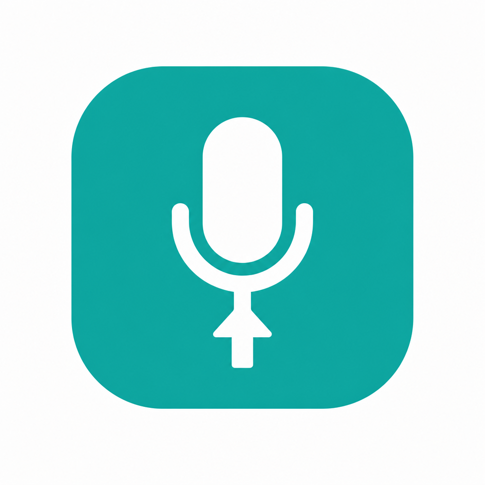

<p align="center">
  
</p>

<h1 align="center">English Interview Gym</h1>

<p align="center">
  <b>Speak with AI interviewers for 20 minutes a day — turn everyday English into interview fluency.</b><br>
  <b>Voice mock interviews · live hints · click-to-lookup · instant corrections · streaks &amp; stats — 100% local, your data never leaves your computer.</b>
</p>

<p align="left">
  <a href="README_en.md"><b>English</b></a> | <a href="README.md"><b>中文</b></a>
</p>

<p align="center">
  
  
  
  
</p>

<p align="center">
  
</p>

## Contents

- [What is this](#what-is-this)
- [Quick start](#quick-start)
- [Feature guide](#feature-guide)
  - [Mock interviews](#mock-interviews)
  - [Sample answers &amp; hints](#sample-answers--hints)
  - [Click-to-lookup](#click-to-lookup)
  - [Instant feedback &amp; scoring](#instant-feedback--scoring)
  - [Session review &amp; errorbook](#session-review--errorbook)
  - [Streaks &amp; progress](#streaks--progress)
  - [Question card wall](#question-card-wall)
  - [Resume import](#resume-import)
- [Configuration](#configuration)
- [Customize &amp; extend](#customize--extend)
- [Project structure](#project-structure)
- [Privacy](#privacy)
- [FAQ](#faq)
- [License](#license)

## What is this

A self-hosted English interview trainer that runs on your own computer. The core loop is one thing only — **speaking out loud**:

> The AI interviewer asks (voice) → you answer out loud (transcribed) → instant corrections, a score, and a better way to say it → follow-up or next question

Every session feeds your streaks and stats; every question keeps a history, so you can re-practice it and watch a real improvement curve. Built for three common problems:

- **No one to practice with** — 3 AI interviewer personas × 82 curated questions (HR screen / technical / stress interview), available any time;
- **You don't know what to say** — every question ships with a 30–45 s sample answer (a **generic framework** version out of the box; import your resume to unlock a **personalized** version), every word across the app is one tap away from a definition, and a **read-aloud mode** covers the "I'm completely stuck" case;
- **No feedback after practice** — each answer gets Correction / Upgrade / Revision cards plus a 1–10 score; each session ends with a five-dimension review report and an errorbook.

| Feature | What it does | Where |
|---|---|---|
| 🎙️ Mock interviews | 3 personas × 3 question sets, voice Q&A with natural follow-ups | Home → "Choose your AI tutor" |
| 💡 Sample answers | A 30–45 s model answer per question: generic / personalized | Chat → "📖 Sample answer" |
| 🔍 Click-to-lookup | IPA · contextual meaning · examples · pronunciation · favourites | Any word, anywhere |
| ✍️ Instant feedback | Correction / Upgrade / Revision + 1–10 score | Automatic after each answer |
| 📋 Review report | Five-dimension scoring + next-focus + errorbook | Top-right "Review" |
| 🔥 Streaks & progress | Streak days · daily goal ring · 14-day calendar | Home check-in panel |
| 🗂 Question card wall | 82 cards: status / best score / trend / per-question history | Home → "Choose a question set" |
| 📄 Resume import | Unlocks personalized answers grounded in your real experience | "📄 My resume" |

## Quick start

**Requirements**: macOS (Apple Silicon recommended) + Python 3.12 + `ffmpeg` (`brew install ffmpeg`) + an API key (Tencent Cloud TokenHub, or any OpenAI-compatible gateway).

### 1. Clone &amp; install

```bash
git clone https://github.com/Chemwzd/english-interview-gym.git
cd english-interview-gym
python3 -m venv .venv            # or with uv: uv venv .venv --python 3.12
.venv/bin/pip install -r app/requirements.txt
```

### 2. Add your API key

```bash
cp app/.env.example app/.env     # then set TOKENHUB_API_KEY=your-key
                                 # get one at https://console.cloud.tencent.com/tokenhub
                                 # (one key covers the LLM + speech recognition + speech synthesis)
```

Or run the interactive setup helper (validates the key online before saving):

```bash
python3 scripts/setup_env.py
```

### 3. Launch

```bash
bash scripts/run_server.sh       # or double-click "打开训练系统.command" on macOS
```

Open http://127.0.0.1:8765 (allow microphone access in your browser on first use).

### 4. Your first session (~10 minutes)

1. Home → "Choose your AI tutor" → preview voices and pick a persona;
2. "Choose a question set" → start with `baseline-8` (8 warm-up questions);
3. Open any card → "🎙 Practise from this question" → click the mic (or press Space) and speak;
4. Click the mic again to stop → read the transcript, feedback cards and score → next question;
5. When done, click "Review" (top-right) to generate the session report.

### 5. Health check &amp; weekly report (optional)

```bash
.venv/bin/python scripts/check_stack.py       # verify every pipeline: LLM / ASR / TTS
.venv/bin/python scripts/baseline_report.py   # practice weekly report
```

## Feature guide

### Mock interviews

**What it does**: a real back-and-forth conversation — the interviewer speaks a question, you answer out loud, and your speech is transcribed automatically before the follow-up or next question.

- 3 personas (`materials/personas/`): `hr-friendly` (friendly HR), `tech-lead` (technical interviewer), `stress` (stress interview);
- 3 question sets: `baseline-8` (8 warm-up questions), `interview-core` (14 core questions), `mnc-60` (60 high-frequency big-tech questions).

**How to use**: pick a persona → pick a set → "🎙 Practise from this question" → click the mic (or press Space) → click again to finish → read the feedback → next question. Two answering modes are available in the chat header ("speak freely / read the sample aloud"); you can skip a question or end the session with "Review" at any time.

**How to configure**:
- Max answer length: `app/config.yaml` → `session.max_answer_seconds` (default 120 s);
- Voices: `app/config.yaml` → `tts.voices` (one voice per persona);
- Your own questions/sets: see [Customize &amp; extend](#customize--extend).

### Sample answers &amp; hints

**What it does**: before answering any question, see how it *could* be answered — a 30–45 s (about 60–100 words) business-style model answer:

- **🧩 Generic version**: works out of the box, with `[bracketed]` placeholders you replace with your own details;
- **🎯 Personalized version**: unlocked after importing your resume — built from your real experience and numbers (see [Resume import](#resume-import)).

**How to use**: in the chat, click "📖 Sample answer" → switch between the two tabs → click "🎧 Read this aloud" to enter read-aloud mode.

**How to configure**: none needed; the personalized version depends on whether you imported a resume.

### Click-to-lookup

**What it does**: tap **any English word** in the conversation, sample answers, feedback cards or review reports and get IPA, part of speech, a **context-aware** meaning, an example sentence and pronunciation; one click saves it to your vocabulary. The same word gets different glosses in different contexts.

**How to use**: click a word → read the card → 🔊 hear it → ⭐ save it. Your saved words live in the "⭐ Favourites" list.

**How to configure**: none needed; lookups are cached in `data/gloss_cache.json`, so repeat lookups are instant.

### Instant feedback &amp; scoring

**What it does**: every answer automatically gets three cards:

- **Correction** — grammar / word choice / tense fixes;
- **Upgrade** — turns casual English into the polished phrasing interviewers expect;
- **Revision** — a full polished rewrite you can read back.

Plus a 1–10 overall score. In read-aloud mode you also get a **reading accuracy** score (word-level missed / extra words against the script).

**How to use**: it appears automatically after each answer; words inside the cards are clickable and savable too.

**How to configure**: none.

### Session review &amp; errorbook

**What it does**: end a session to generate a "Review": scores across content / structure / grammar / vocabulary / fluency, a next-focus suggestion and a drill list; mistakes that keep recurring are collected into an errorbook for focused re-practice.

**How to use**: top-right "Review" → the report takes 10–20 s to generate (also saved to `data/reports/`).

**How to configure**: none.

### Streaks &amp; progress

**What it does**: tracks your "speaking volume" like a fitness app: streak days, a daily goal ring (20 minutes by default), a 14-day minutes calendar and stat cards; hitting 3 / 7 / 14 / 30 / 50 / 100 consecutive days triggers a celebration.

**How to use**: the check-in panel on the home page updates automatically; every finished session counts toward today.

**How to configure**: change `app/config.yaml` → `session.daily_goal_minutes` (default 20).

### Question card wall

**What it does**: each question set opens as a wall of illustrated cards (title, status, best score). Open a card for its **per-question history** — date, mode (free / read-aloud), duration, speaking rate (WPM), score — with a score trend line; you can restart practice from any question.

**How to use**: home → "Choose a question set" → card wall; the "▶ Continue" button jumps to your first unpractised question (it becomes "▶ Practise again" once the set is finished).

**How to configure**: drop a PNG at `materials/question-bank/images/<set>/<question-id>.png` and it shows up on the card wall (the bundled sets already include illustrations).

### Resume import

**What it does**: upload your resume (`.docx` / `.pdf` / paste text) to unlock the **🎯 personalized** sample answers, built from your real experience, projects and numbers. The resume is stored on your machine only.

**How to use**: top-right "📄 My resume" → choose a file or paste text → save; delete it any time (you simply fall back to generic versions).

**How to configure**: you can also edit `materials/profile.md` by hand (see `materials/profile.example.md` for the format).

## Configuration

### Environment variables (`app/.env`)

| Variable | Required | Purpose |
|---|---|---|
| `TOKENHUB_API_KEY` | ✅ | One key for LLM + speech recognition + speech synthesis (Tencent Cloud TokenHub or a compatible gateway) |
| `TOKENHUB_BASE_URL` | – | Override the API base URL (point it at any OpenAI-compatible gateway) |

### App settings (`app/config.yaml`)

| Setting | Default | Notes |
|---|---|---|
| `llm.model` | `deepseek/deepseek-flash` | Main chat model |
| `llm.fallback_models` | see file | Fallback chain if the main model fails |
| `asr.driver` | `auto` | `auto` / `tokenhub` (cloud ASR) / `local` (mlx-whisper, macOS only) |
| `tts.driver` | `tokenhub` | `tokenhub` / `macos_say` (offline fallback) |
| `tts.voices` | see file | One voice per persona |
| `session.daily_goal_minutes` | `20` | Daily goal (minutes) for the check-in ring |
| `session.max_answer_seconds` | `120` | Max length of one answer |
| `server.port` | `8765` | Server port |
| `tools.ffmpeg` | `ffmpeg` | Path to the ffmpeg binary |

### Runtime data (`data/`, local only)

| Path | Contents |
|---|---|
| `data/sessions/*.jsonl` | Per-round records of every session (with scores) |
| `data/reports/` | Review reports |
| `data/errorbook.jsonl` | Errorbook |
| `data/favorites.jsonl` | Saved words &amp; sentences |
| `data/gloss_cache.json` | Click-to-lookup cache |
| `data/audio/` | Recordings |

## Customize &amp; extend

- **Questions / question sets** — plain YAML; edit or add files under `materials/question-bank/`:

  ```yaml
  key: my-bank
  title: My question set
  questions:
    - id: q1
      round: HR screen
      category: Intro
      text: "Tell me about yourself."
      intent: Why they ask this.
      hint: How to structure your answer.
      followups:
        - "What's the one thing you want me to remember?"
  ```

- **Question illustrations** — drop a PNG at `materials/question-bank/images/<set>/<question-id>.png` and it appears on the card wall;
- **Interviewer personas** — `materials/personas/*.md` (define the character in the `### system` block);
- **Story bank** — copy `materials/stories/template.md` to build 5–8 polished personal stories that make your answers concrete.

## Project structure

```text
english-interview-gym/
├── 打开训练系统.command          # one-click launcher (macOS double-click)
├── app/
│   ├── config.yaml              # app settings (models / speech / daily goal)
│   ├── .env.example             # env template (copy to .env and add your key)
│   ├── requirements.txt
│   ├── server/                  # FastAPI backend: sessions · LLM · ASR · TTS · reports
│   └── web/                     # single-page frontend (no build step)
├── materials/
│   ├── personas/                # 3 interviewer personas
│   ├── question-bank/           # 3 question sets (YAML) + illustrations + meta
│   ├── stories/                 # personal story bank (template + guide)
│   ├── wordlist/                # word list
│   └── profile.example.md       # resume template (copy to profile.md and edit)
├── scripts/                     # setup_env · run_server · check_stack · baseline_report
├── data/                        # runtime data (local only, gitignored)
└── docs/                        # RUNBOOK · PRACTICE-PLAN · image assets
```

## Privacy

- **100% local**: the server only listens on `127.0.0.1`; all training data (recordings, transcripts, reports, vocabulary) lives in `data/` on your machine and is never uploaded to any third party;
- **Minimal outbound calls**: audio and text of your answers are sent only to the API endpoint **you** configured (for transcription and feedback); your key stays in `app/.env` on your machine;
- **No telemetry**: no analytics, no accounts;
- **Zero personal data in the public repo**: `app/.env`, `materials/profile.md` and `data/` are gitignored and never shipped.

## FAQ

| Symptom | Fix |
|---|---|
| `402 / 401007` on submit | Enable "postpaid billing" in the console for the speech models; or set `asr.driver: local` |
| Microphone unavailable | Open via `http://127.0.0.1` (not a LAN IP); allow microphone permission in the browser |
| Port in use | Change `server.port` in `app/config.yaml` and the `--port` flag in `scripts/run_server.sh` |
| Different voices / LLM | Voices: `tts.voices` · Model: `TOKENHUB_BASE_URL` + `llm.model` for any OpenAI-compatible model |
| Don't want to use Tencent Cloud | Point the LLM at any OpenAI-compatible gateway (`TOKENHUB_BASE_URL` + `llm.model`); for speech use local mode: `asr.driver: local` + `tts.driver: macos_say` (macOS only) |

## License

MIT — see [LICENSE](LICENSE).
